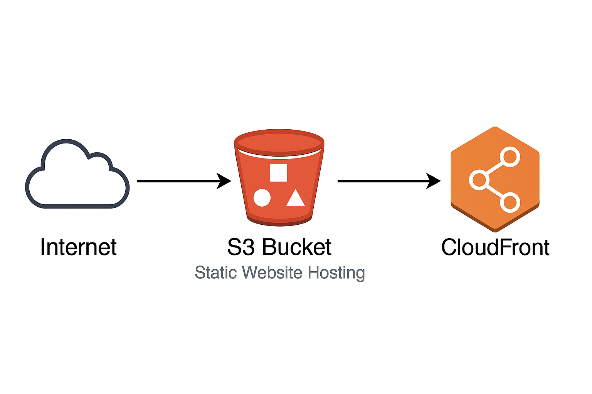

# AWS/Github.io Portfolio Website

This is a personal portfolio website for Justin Toliver, showcasing game development and backend software engineering projects. The website is hosted through github.io, and through **AWS** using S3 buckets. 

## Project Structure

### AWS Diagram

### Files

- **index.html**: Redirects to the main portfolio page.
- **static/style/home.css**: Contains the CSS styles for the portfolio.
- **templates/home.html**: The main portfolio page with project details and contact information.

## Usage

1. Open `index.html` in a web browser to be redirected to the main portfolio page.
2. The main portfolio page is located at `templates/home.html`.

**Or**

1. Go to https://betermain.github.io/

**Or**

1. Go to http://justin-practice-portfolio-site.s3-website-us-east-1.amazonaws.com/templates/home.html

## Styles

The CSS styles are defined in `static/style/home.css` and include styles for the header, content, projects, and contact information sections.

## Contact Information

- **Name**: Justin Toliver
- **Email**: justintoliver21@gmail.com
- **Phone Number**: 678-818-7495

## Projects

### Game Projects

- [Speed Saver](https://betermain.itch.io/speed-saver)
- [The Pirate Platformer](https://betermain.itch.io/the-pirate-platformer)
- [Space Escape](https://betermain.itch.io/space-escape)

### Coding Projects

- [Video Game (Python)](https://github.com/BeterMain/gacha-game)
- [Clock-In Clock-Out System (Java)](https://github.com/BeterMain/cs310-teamproject-fa23)
- [Expense Tracker (Python/Flask/MySQL)](https://github.com/BeterMain/ExpenseTracker)

## Social Links

- [itch.io](https://betermain.itch.io)
- [GitHub](https://github.com/BeterMain)
- [LinkedIn](https://www.linkedin.com/in/justin-toliver-327840216/)

## License

This project is licensed under the MIT License.
